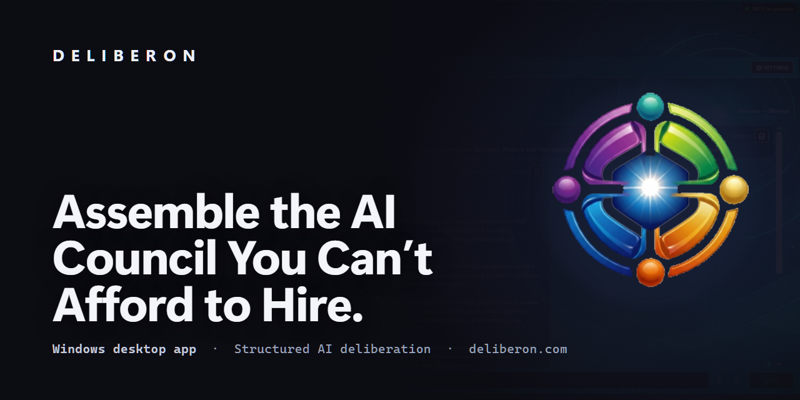

# Deliberon

**Multi-Agent AI Deliberation Council for Windows**

> *This is Intelligence. Orchestrated Intelligently.*

---

## The Problem With Single-AI Responses

Single-AI responses are designed to sound confident and agreeable. They hallucinate. They tell you what you want to hear. They collapse under serious cross-examination. When the stakes are real — a business decision, a product strategy, a market analysis, a strategic pivot — one confident AI answer is not enough.

**Deliberon is built on a different premise: structured disagreement produces better answers than polished agreement.**

---

## What Is Deliberon?

Deliberon convenes a **structured council of specialised AI agents** to deliberate on your question. Each agent has a defined role, a distinct reasoning profile, and the mandate to challenge — not just agree. Agents read each other's arguments, push back with evidence, and a dedicated Critic attacks the council's own emerging consensus.

The result is a formal **Decision Record**: the strongest arguments for and against, dissenting views preserved, a traceable final recommendation, and the cryptographic proof that it is the record the council actually produced.

---

## How It Works

1. **Submit your topic** — a question, decision, or problem you need rigorous analysis on
2. **The council deliberates** — agents form independent positions, then challenge each other across multiple rounds
3. **Sycophancy is detected and blocked** — agents cannot simply agree; they must justify with evidence
4. **Minority dissent is protected** — the Gemini Principle prevents valid minority positions from being suppressed by consensus pressure
5. **The Critic attacks** — a dedicated adversarial agent challenges the council's emerging recommendation
6. **You receive a Decision Record** — a structured document with the full deliberation history, exportable to Markdown, HTML or PDF

---

## The Agent Designer

Deliberon's **Agent Designer** lets you build your own council members from the ground up — no code, no templates. It is one of the most powerful tools in the product and exists nowhere else.

Each custom agent is defined across the dimensions that actually shape how it reasons in a council:

- **Persona** — voice, style, values, and disposition
- **Vocation** — domain expertise and the deliberation role it fills
- **Operational Posture** — how it behaves under insufficient evidence: what advances, what doesn't, and who bears the burden of proof
- **Council Role** — its archetype (challenger, builder, synthesizer, gatekeeper), when to activate it, and which agents it pairs with
- **Speaking Position** — Contributor, Primer, or Challenger — controlling *when* it speaks in dialectical rounds (e.g. Hegelian Thesis → Antithesis → Synthesis)
- **Conversational Mode & handoffs** — a behavioural directive defining what the agent is and is not, with a graceful handoff to a named counterpart when it reaches its limit
- **Teaching Persona** — how it explains and instructs

And it gives every agent a face and a voice:

- **Voice profile** — an AI-generated, fully editable VoxCPM2 voice tuned by tone, age, energy, accent, and gender, with one-click in-app preview
- **Voice cloning** — or use *your own* voice
- **Avatar portrait** — a generated character portrait shown on the agent's sidebar card
- **Share to the Community Gallery** — publish your agent for others to use

---

## Key Features

- **Guided first run** — a fresh install opens into a one-time walkthrough: the mind that thinks, the voice that speaks, your first convention, and your agent roster. Every new agent gets its own short setup wizard too
- **The Cognition Matrix** — one screen for provider setup, *The Mind* above *The Voice*, with a My Voice clone studio: type a sentence and hear it in your own voice
- **[28 built-in Council Modes](https://www.deliberon.com/modes)** (plugins can register more) — across decision-making (Feasibility Study, Jury Verdict, Tradeoff Analysis, Consensus Review), engineering (Architecture Review, Scope Trim, QC Gate, Sprint Planning), analysis (Red Team, Assumption Audit, Root Cause Analysis, Knowledge Audit), creative (Brainstorm, Critique, The Pitch), governance (Proposal Vote, Mediation, Vision Check), and documentation (Document Assembly, Research Synthesis)
- **[Hegelian Dialectic mode](https://www.deliberon.com/modes)** — a three-round Thesis → Antithesis → Synthesis structure for high-stakes truth-seeking, with the Adversary leading a dedicated challenge round
- **Conversational modes** — Round Table, Podcast, and Interview turn the council into a listenable, voiced discussion rather than a verdict engine
- **Decision Records** — every session produces one interactive document holding both the result and its cryptographically signed (per-seat ECDSA P-256) proof, exportable to Markdown, HTML or PDF
- **[The Agent Designer](https://www.deliberon.com/agent-designer)** — build, voice, and deploy fully custom council agents (see above)
- **Native local models** — browse and download GGUF models directly from Hugging Face *inside* Deliberon, then run them locally — no separate tooling required
- **The Library** — a built-in knowledge system that grounds agents in your own source material
- **Project-scoped conventions** — sessions and agent rosters are linked to projects, with full history and Decision Record export; agents never bleed between projects
- **MCP Server** — AI orchestrators (Claude Code and compatible tools) can drive Deliberon programmatically via 200+ tools
- **[Provider agnostic](https://www.deliberon.com/providers)** — each agent can use a different AI provider; mix cloud and local freely

---

## Supported AI Providers

Each specialist in the council can be independently configured:

| Family | Providers |
|--------|-----------|
| **Cloud** | Claude (Anthropic), OpenAI, **Google Gemini**, **Grok (xAI)**, DeepSeek, Mistral, Groq, Cerebras, Together, Fireworks, NVIDIA, MiniMax, OpenRouter, Hugging Face, AIMLAPI |
| **Local** | Ollama, LM Studio, Jan, GPT4All, LocalAI, Oobabooga, any local OpenAI-compatible server, and GGUF models downloaded in-app |
| **Terminal agents** | Claude Code, Codex and Agent Zero sit in the council as full participants, with the same deliberation rights as any specialist |

**25 providers in total.** Any OpenAI-compatible endpoint works even if it is not named above.

No lock-in — use the best model for each role, and mix cloud and local freely across the council. **[Full provider detail →](https://www.deliberon.com/providers)**

---

## Who Is Deliberon For?

### Founders & Entrepreneurs
Making high-stakes product and strategy calls with limited time, capital, and advisors? Deliberon gives you a council. Stress-test your business model, evaluate a market opportunity, weigh a strategic pivot — get structured multi-perspective analysis in minutes instead of booking a boardroom.

### Content Creators
Deliberon is rapidly becoming a content-creation engine. Spin up a cast of voiced, distinct AI personalities and put them in a **Podcast**, **Interview**, or **Round Table** — each producing a listenable, fully voiced transcript. Generate sourced white papers and reports with **Research Synthesis**, assemble long-form documents with multiple authors via **Document Assembly**, and give every character its own face, voice, and personality in the Agent Designer. Scripts, episodes, panels, and articles — produced by a council, not a single prompt.

### Business Owners
Tired of AI tools that confidently tell you what you want to hear? Deliberon is built specifically to surface the best *counter-argument* to your preferred position before you commit to it. Every Decision Record is auditable and shareable.

### Start-Ups
Before you commit engineering time, funding, or team capacity to a direction, put it to the council. Red Team mode sends a dedicated adversarial agent after your plan. Feasibility Study mode pressure-tests assumptions. Architecture Review mode stress-tests technical decisions. All before a single line of code is written.

### Teams & Decision Makers
Want decisions with a paper trail? Every Deliberon session produces a signed Decision Record that captures the deliberation, the dissent, and the reasoning — not just the conclusion. Share it. Revisit it. Defend it.

---

## CODE·A.I. — forty vocational specialists

**CODE·A.I.** is a corpus of forty professional vocational specialists, each built conscience-first with its own sourced library, voice and portrait — from the Coder and the Apothecary to the Writer, the Counselor and the Herald.

They are browsable and purchasable **inside Deliberon**: a tab in the Hall of Agents opens the **Symbiosis Map**, a hoverable wheel of all forty vocations, alongside **The Forty** organised by domain and a **Collections** view for domain packs, outcome tracks and the Full Canon. The marketplace renders with no network connection at all, and checkout always opens in your real browser.

**Every specialist is a separate purchase, from $19** — individually, in domain packs, in outcome tracks, or as the discounted Full Canon. **They are never bundled with a Deliberon licence, at any tier.** A licence of **Standard or above** is required to *run* one; it does not include one.

**→ [Meet the forty](https://www.deliberon.com/code-ai)**

---

## Pricing & Licensing

Deliberon is a **one-time purchase**. Buy it once and own it — no subscription, no seat fees, no expiry.

| Tier | Price | What it adds |
|------|-------|--------------|
| **[Free](https://www.deliberon.com/download)** | **$0** — no account, no card, no expiry | Always-live Chairman, 3 council agents, 5 council modes, full Decision Records, cryptographic session signing, bring your own AI, voice input |
| **[Standard](https://www.deliberon.com/pricing)** | **$79** one-time | 6 council agents, 10 modes, Round Table, INTEGRA alignment, reusable Teams & Loadouts, themes, the Community Gallery, and **the ability to run CODE·A.I. specialists** (each bought separately) |
| **[Pro](https://www.deliberon.com/pricing)** | **$149** one-time | 10 council agents, 18 modes, Podcast & Interview, the **Agent Designer**, the Agent Recruiter, agent vaults & memory tiers, document generation, per-agent voices and audio export |
| **[Elite](https://www.deliberon.com/pricing)** | **$249** one-time | All 15 council agents, all 28 modes including the **Hegelian Dialectic**, Research Mode, and the ability to run plugin agents |

> **The CODE·A.I. specialists are not included in any tier.** No licence — Standard, Pro or Elite — bundles them. Each specialist, pack, track or the Full Canon is a **separate purchase**, from $19. A licence of Standard or above is what makes a purchased specialist *run*; it never grants you one.

**A 30-day Elite trial is included, no card and no account required.** It grants full Elite for 30 days — every council agent and every council mode — with two honest limits: the **Agent Designer is capped at 5 agents**, and those agents are yours to keep forever; and the **Community Gallery is for licensed users**, so it is not part of the trial. When the trial ends you drop to Free, and anything you built stays working.

**[See the full pricing breakdown →](https://www.deliberon.com/pricing)**

---

## System Requirements

- Windows 10 or Windows 11 (64-bit)
- .NET 8 Desktop Runtime (bundled in the installer)
- An API key for at least one supported AI provider, *or* a local model (Ollama, LM Studio, or a GGUF model downloaded in-app)

---

## Installation

1. Download the latest installer from the [Releases](https://github.com/Pr1m4lc0d3/deliberon-releases/releases) page, or from **[deliberon.com/download](https://www.deliberon.com/download)**
2. Run `Deliberon-Setup.exe`
3. Follow the setup wizard (installs .NET 8 automatically if not present)
4. Launch Deliberon and configure your first AI provider

---

## Releases

All releases are published on the [Releases](https://github.com/Pr1m4lc0d3/deliberon-releases/releases) page. Each release includes:
- A standalone Windows installer (`.exe`)
- A zipped copy of the installer (`.zip`)
- Full version notes describing what changed

---

## About

Deliberon is a solo developer project. The current release targets Windows and supports all major cloud and local AI providers.

- **Website** — [deliberon.com](https://www.deliberon.com)
- **How it works** — [deliberon.com/how-it-works](https://www.deliberon.com/how-it-works)
- **Council modes** — [deliberon.com/modes](https://www.deliberon.com/modes)
- **The Agent Designer** — [deliberon.com/agent-designer](https://www.deliberon.com/agent-designer)
- **CODE·A.I. specialists** — [deliberon.com/code-ai](https://www.deliberon.com/code-ai)
- **INTEGRA alignment** — [deliberon.com/integra](https://www.deliberon.com/integra)
- **Pricing** — [deliberon.com/pricing](https://www.deliberon.com/pricing)
- **Support** — [deliberon.com/support](https://www.deliberon.com/support)
- **Privacy** — [deliberon.com/privacy](https://www.deliberon.com/privacy)

Feedback and bug reports are welcome.

---

*This is Intelligence. Orchestrated Intelligently.*
